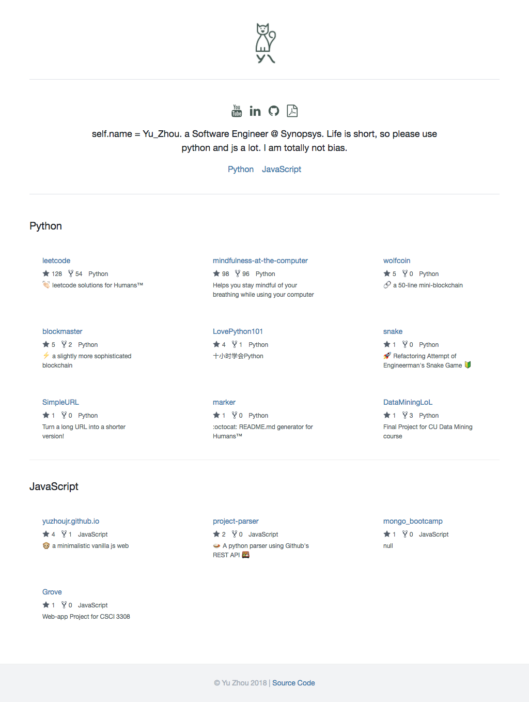

<!--
██╗   ██╗██╗   ██╗███████╗██╗  ██╗ ██████╗ ██╗   ██╗     ██╗██████╗
╚██╗ ██╔╝██║   ██║╚══███╔╝██║  ██║██╔═══██╗██║   ██║     ██║██╔══██╗
 ╚████╔╝ ██║   ██║  ███╔╝ ███████║██║   ██║██║   ██║     ██║██████╔╝
  ╚██╔╝  ██║   ██║ ███╔╝  ██╔══██║██║   ██║██║   ██║██   ██║██╔══██╗
   ██║   ╚██████╔╝███████╗██║  ██║╚██████╔╝╚██████╔╝╚█████╔╝██║  ██║
   ╚═╝    ╚═════╝ ╚══════╝╚═╝  ╚═╝ ╚═════╝  ╚═════╝  ╚════╝ ╚═╝  ╚═╝
                                                                     -->

<h1 align="center"></h1>   

> 
[yuzhoujr.com](http://www.yuzhoujr.com) &nbsp;&middot;&nbsp;
>   [@yuzhoujr](https://github.com/yuzhoujr) &nbsp;&middot;&nbsp;
>   [@yuzhoujr](https://linkedin.com/in/yuzhoujr)
